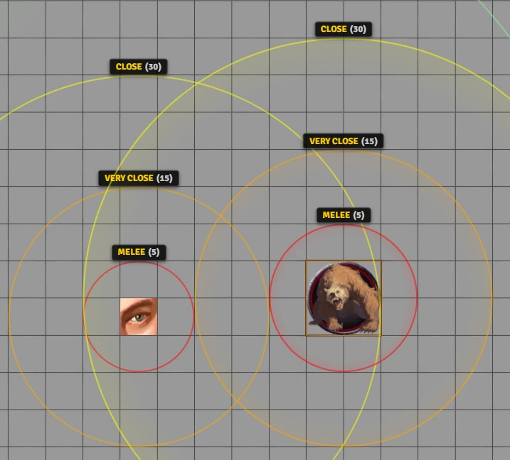
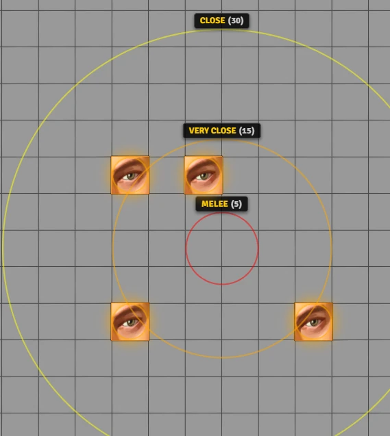
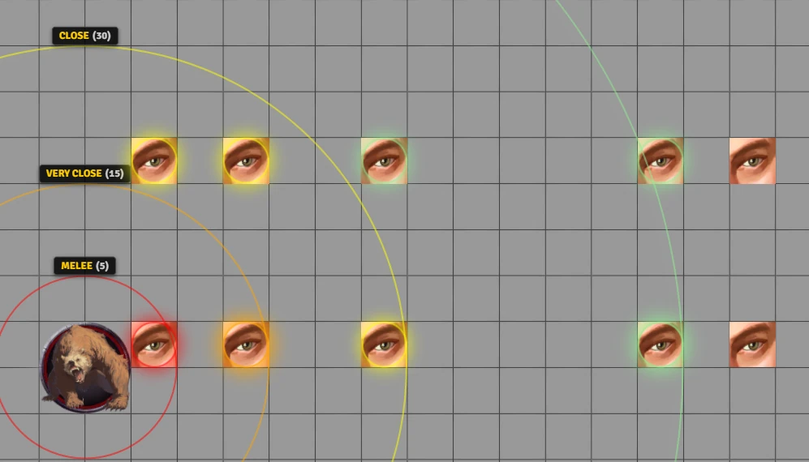
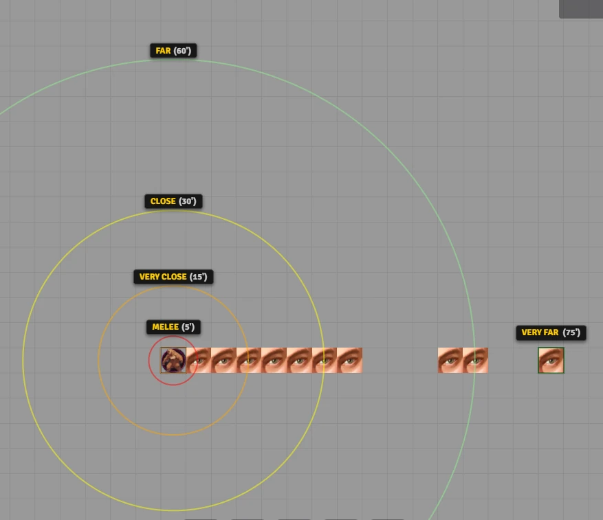
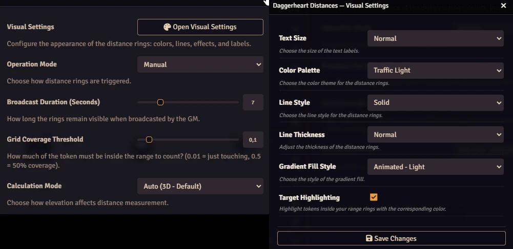

# Daggerheart: Distances

A visual and intuitive utility for the **Daggerheart** system in Foundry VTT. It automatically displays distance rings (Melee, Very Close, Close, Far) around tokens and calculates distances between characters instantly, helping players and GMs visualize combat ranges without needing to measure manually.

<video src="https://github.com/user-attachments/assets/c6e6a905-9cd4-4666-b742-9719f91a0a7b" 
       controls 
       width="720"
       autoplay 
       loop 
       muted></video>

## 🌟 Key Features

### 📏 For Everyone (Players & GM)

* **Visual Range Rings:** Instantly see the 4 main range bands of Daggerheart:

  * **Melee:** 5 ft.

  * **Very Close:** 15 ft.

  * **Close:** 30 ft.

  * **Far:** 60 ft.

* **Smart Hover:** Hover your mouse over any token to see exactly how far it is from your character. No ruler needed!

* **Easy Toggle:** Turn the rings on or off quickly using a button in the Token HUD or a keyboard shortcut.

* **Smart Edge Detection:** Accurate for tokens of all sizes! The system measures distance from edge-to-edge rather than center-to-center. It also checks visual coverage: a token is only considered "in range" if a specific percentage of its body (configurable) is physically inside the ring, ensuring that what you see matches the rules.

**Set how much of a token must be inside the circle to be considered in range.**
<p align="center"></p>

**The system accounts for token size when calculating range.**
<p align="center"></p>

* **Mass Measurement:** Select multiple tokens and use the macro `DHDistances.MassMeasurement();` to generate distance rings from the center of the group.
<p align="center"></p>

* **Target Highlighting:** Valid targets within range rings now glow with the ring's color.
<p align="center"></p>

* **Ghost Preview:** Range rings now follow the token preview while dragging to test positions.

### 🎨 Customization

* **Beautiful Themes:** Choose from pre-made color palettes like "Traffic Light", "Neon Cyberpunk", or "Warm Sunset".

* **Visual Styles:** Configure the rings to have solid, dotted, or dashed lines, and adjust their thickness.

* **Immersive Effects:** Enable animated gradient fills that pulse gently, or keep it simple with static colors.

## ⚙️ How to Use

### Toggling Rings

<p align="center"></p>

You have many easy ways to show or hide the range rings around a token:

1. **Token HUD:** Right-click a token to open the HUD, then click the **Circle** icon (<i class="fas fa-circle-dot"></i>).

2. **Keyboard Shortcut:** Select a token and press **`R`** to toggle the rings on/off instantly. You can use **`M`** for Mass Measurement.

3. You can also use the macro `DHDistances.Toggle();`. This works for multiple selected tokens. Use `DHDistances.MassMeasurement();` for Mass Measurement.

```js
DHDistances.Toggle({mode: '2d'}); // Calculates distance ignoring elevation.
```

```js
DHDistances.Toggle({mode: '3d'}); // Calculates distance accounting for elevation.
```

```js
DHDistances.Toggle({mode: 'both'}); // Shows both 3D and 2D distances.
```

### Configuration

Go to the **Module Settings** tab in Foundry VTT to customize the look and feel:

<p align="center"></p>

## 🚀 Installation

Install via the Foundry VTT Module browser or use this manifest link:

* *https://raw.githubusercontent.com/brunocalado/daggerheart-distances/main/module.json*

## 📜 Changelog

You can read the full history of changes in the [CHANGELOG](CHANGELOG.md).

## ⚖️ Credits and License

* **Code License:** [LICENSE](LICENSE).

* This module is a fork from [this](https://github.com/fsergler/foundry_combat_distances) 

**Disclaimer:** This module is an independent creation and is not affiliated with Darrington Press.

# 🧰 My Daggerheart Modules

| Module | Description |
| :--- | :--- |
| 💀 [**Adversary Manager**](https://github.com/brunocalado/daggerheart-advmanager) | Scale adversaries instantly and build balanced encounters in Foundry VTT. |
| ☠️ [**Death Moves**](https://github.com/brunocalado/daggerheart-death-moves) | Enhances the Death Move moment with immersive audio and visual effects. |
| 📏 [**Distances**](https://github.com/brunocalado/daggerheart-distances) | Visualizes combat ranges with customizable rings and hover calculations. |
| 🤖 [**Fear Macros**](https://github.com/brunocalado/daggerheart-fear-macros) | Automatically executes macros when the Fear resource is changed. |
| 😱 [**Fear Tracker**](https://github.com/brunocalado/daggerheart-fear-tracker) | Adds an animated slider bar with configurable fear tokens to the UI. |
| 🎲 [**Stats**](https://github.com/brunocalado/daggerheart-stats) | Tracks dice rolls from GM and Players. |
| 🧠 [**Stats Toolbox**](https://github.com/brunocalado/dh-statblock-importer) | Import using a statblock. |
| 🛒 [**Store**](https://github.com/brunocalado/daggerheart-store) | A dynamic, interactive, and fully configurable store for Foundry VTT. |
| 📦 [**Extra Content**](https://github.com/brunocalado/daggerheart-extra-content) | Homebrew for Daggerheart. |
| ⚡ [**Quick Actions**](https://github.com/brunocalado/daggerheart-quickactions) | Quick access to common mechanics like Falling Damage, Downtime, etc. |
| 📜 [**Quick Rules**](https://github.com/brunocalado/daggerheart-quickrules) | Fast and accessible reference guide for the core rules. |

# 🗺️ Adventures

| Adventure | Description |
| :--- | :--- |
| ✨ [**I Wish**](https://github.com/brunocalado/i-wish-daggerheart-adventure) | A wealthy merchant is cursed; one final expedition may be the only hope. |
| 💣 [**Suicide Squad**](https://github.com/brunocalado/suicide-squad-daggerheart-adventure) | Criminals forced to serve a ruthless master in a land on the brink of war. |